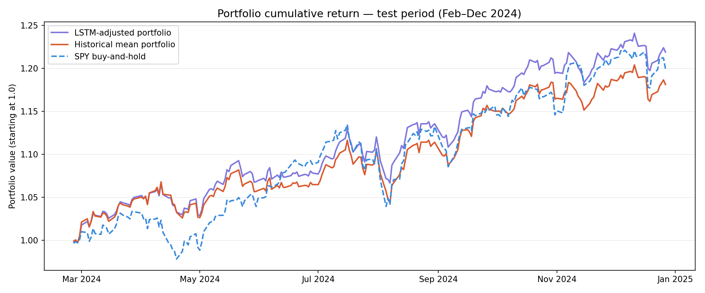

# Financial Time-Series Forecasting for Return Prediction

> LSTM-based ETF return prediction with downstream portfolio optimization.  
> CMPE 401 - University of British Columbia Okanagan

---

## Overview

This project investigates whether deep learning-based return predictions can improve risk-adjusted portfolio performance compared to traditional historical mean estimation.

A multi-output LSTM is trained on 40 engineered technical features across four ETFs (SPY, QQQ, GLD, VEQT). Rather than evaluating predictions in isolation, the model's outputs are used as tilting signals inside a Markowitz mean-variance optimizer. The LSTM-adjusted portfolio is then compared against a historical mean portfolio and SPY buy-and-hold over a held-out test period (February–December 2024).

---

## Key Results

| Metric | LSTM-Adjusted | Historical | SPY Buy-and-Hold |
|---|---|---|---|
| Total return | **+21.89%** | +18.11% | +19.92% |
| Ann. return | **+25.84%** | +21.32% | +23.49% |
| Ann. volatility | **10.16%** | 10.34% | 12.52% |
| Sharpe ratio | **2.052** | 1.578 | 1.477 |
| Max drawdown | **-5.58%** | -6.52% | -8.41% |



---

## Project Structure

```
financial-ts-forecasting/
├── data/
│   ├── fetch_data.py         # downloads ETF data via yfinance
│   ├── preprocess.py         # aligns ETFs, computes daily returns
│   ├── raw/                  # raw OHLCV CSVs (not tracked by git)
│   └── processed/            # returns.csv, prices.csv, sequences/
├── features/
│   └── engineer.py           # feature engineering + sequence construction
├── models/
│   ├── lstm_model.py         # LSTM architecture definition
│   ├── baseline.py           # historical mean baseline model
│   ├── train.py              # training loop
│   └── evaluate.py           # prediction metrics vs baseline
├── portfolio/
│   └── optimize.py           # rolling portfolio optimization + backtest
├── notebooks/
│   └── 01_eda.ipynb          # exploratory data analysis
├── results/
│   ├── figures/              # all plots
│   └── metrics/              # CSVs of prediction and portfolio metrics
└── requirements.txt
```

---

## Data

- **Source:** Yahoo Finance via `yfinance` (`Ticker.history()`)
- **ETFs:** SPY (S&P 500), QQQ (Nasdaq 100), GLD (Gold), VEQT (Vanguard All-Equity, Canada)
- **Period:** February 2019 - December 2024 (1,511 aligned trading days)
- **Note:** Raw CSVs are not tracked by git. Run `fetch_data.py` to reproduce.

---

## Installation

```bash
git clone https://github.com/thndlovu/financial-ts-forecasting.git
cd financial-ts-forecasting
pip install -r requirements.txt
```

---

## Reproducing Results

Run the following scripts in order:

**1. Download data**
```bash
python data/fetch_data.py
```

**2. Preprocess**
```bash
python data/preprocess.py
```

**3. Feature engineering**
```bash
python features/engineer.py
```

**4. Baseline model**
```bash
python models/baseline.py
```

**5. Train LSTM** *(GPU recommended - tested on NVIDIA RTX 4090 via Vast.ai)*
```bash
python models/train.py
```

**6. Evaluate predictions**
```bash
python models/evaluate.py
```

**7. Portfolio backtest**
```bash
python portfolio/optimize.py
```

---

## Model

- **Architecture:** 2-layer LSTM (hidden size 64) + Dropout (0.2) + Linear output
- **Input:** 20-day rolling windows of 40 technical features
- **Output:** Next-day return for all 4 ETFs simultaneously
- **Parameters:** 60,676
- **Training:** Adam (lr=0.001), MSE loss, early stopping (patience=15)
- **Converged:** Epoch 23 on NVIDIA RTX 4090

---

## Portfolio Optimization

For each test day, two portfolios are constructed using a long-only Markowitz max-Sharpe optimizer:

- **Historical portfolio:** expected returns = trailing 252-day mean
- **LSTM-adjusted portfolio:** expected returns = historical mean + normalized LSTM signal (α = 0.3)

The LSTM predictions are used as tilting signals rather than direct return forecasts, improving optimizer stability.

---

## Split

| Set | Period | Samples |
|---|---|---|
| Train | May 2019 – Apr 2023 | 1,008 |
| Validation | Apr 2023 – Feb 2024 | 216 |
| Test | Feb 2024 – Dec 2024 | 217 |

---

## Technologies

- Python 3.12
- PyTorch 2.3
- yfinance, pandas, numpy, scikit-learn
- ta (technical analysis)
- PyPortfolioOpt
- Vast.ai (GPU training)

---

## Author

**Tawana H. Ndlovu**  
School of Engineering, University of British Columbia Okanagan  
CMPE 401 — Self-Defined Project
